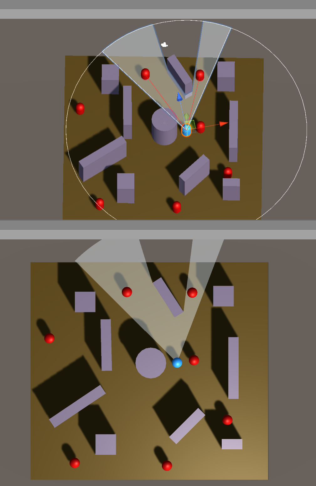

# Field Of View

Field of view - a demonstration of a 2d vision cone in a 3d game. Includes vision being blocked/interupted by solid objects, and enemy detection.

Used the following video as reference and learning material: https://youtu.be/rQG9aUWarwE and https://youtu.be/73Dc5JTCmKI

